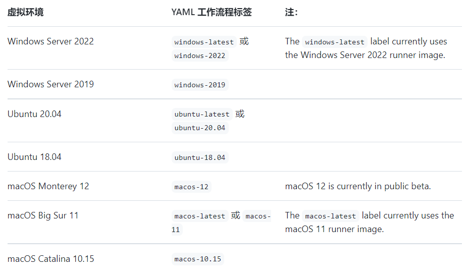

# GitHub Actions

## 什么是Actions

>在github创建的仓库中，Actions是可以自定义的一些列的操作，如：提交代码后触发自动化编译打包和部署到远程服务器上，官方所说的定义是：在仓库中自动化、自定义操作执行软件开发工作流程，目前有很多现成的Actions可以直接拿来使用，也可以进行自定义创建到自己工作流程中。

## Actions的使用

>Actions通常用来两个方面
>
>1. 自动化ci/cd,触发事件后自动化编译打包部署。
>2. 自动添加标签，当有人提issues的时候可以自动化的添加标签

## 组件

>可以把Github Actions 工作流程配置为在存储库发生事件触发。
>
>example: 拉取请求或者推送请求的时候触发工作流程[工作流程理解为jobs]
>
>一个工作流程包含一个作业或者多个作业，这些作业可以按照顺序执行，也可以并发执行，每个作业都会在自己虚拟机中进行，或者在容器中进行，这个运行的进程可以理解为运行了一个runner,每个作业可能会有多个步骤，这个步骤运行自定义的脚本或者运行操作。


### 工作流程

工作流程是一个可配置的自动化过程，它将运行一个或多个作业。 工作流程由签入到存储库的 YAML 文件定义，并在存储库中的事件触发时运行，也可以手动触发，或按定义的时间表触发。文件位于仓库的根目录下的`.github/workflows`

###### 触发工作流程

1. 工作流程存储库发生事件

   ```yml
   # 单个事件触发
   on: push
   # 多个事件触发
   on: [push, fork]
   ```

2. 预定时间

   ```yml
   # 示例在每天 5:30 和 17:30 UTC 触发工作流程
   on:
     schedule:
       - cron:  '30 5,17 * * *'
   ```

###### 使用作业

1. 创建jobs

```yaml
jobs:
  #作业id
  my_first_job:
  	#作业名称
    name: My first job
  my_second_job:
    name: My second job
```

2. 选择运行器

```yaml
runs-on: ubuntu-latest
```



>以上是常见的运行器，就是用哪个虚拟机

3. if控制作业执行

```yaml
name: example-workflow
on: [push]
jobs:
  production-deploy:
    if: github.repository == 'octo-org/octo-repo-prod'
    runs-on: ubuntu-latest
    steps:
      - uses: actions/checkout@v3
      - uses: actions/setup-node@v3
        with:
          node-version: '14'
      - run: npm install -g bats
```


Springboot打包

```yaml
```

